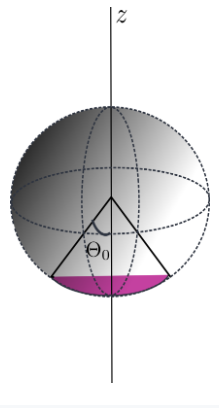
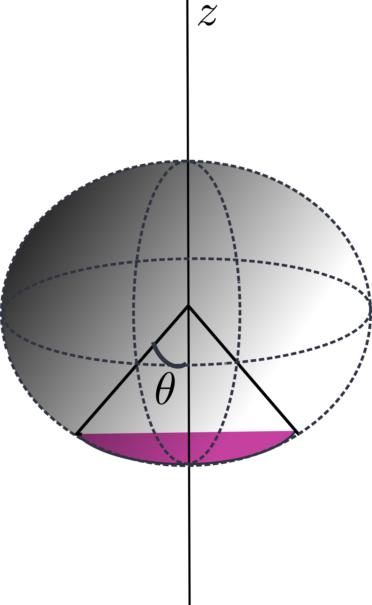
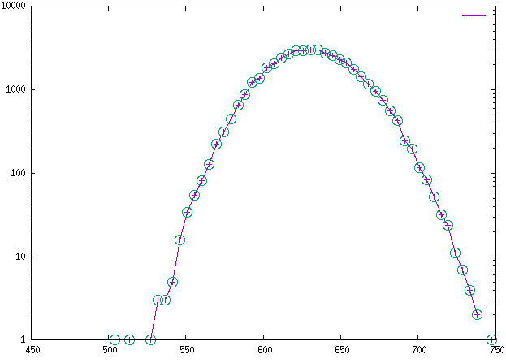
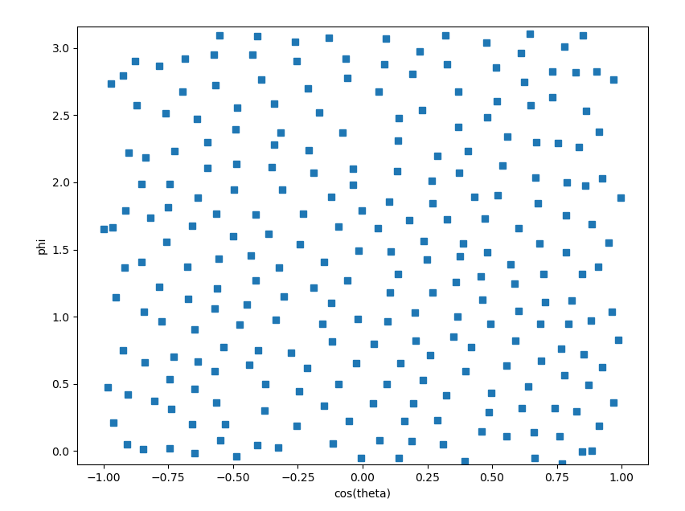
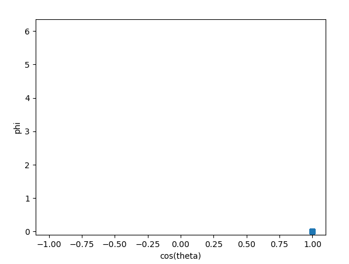

# MeMC
The MeMC is an open-source software package for monte-carlo simulation of elastic shells. The package can be useful to study the mechanics of biological nano-vesicles e.g. Exosomes. 

Micro and nano vesicles play a crucial role in biology and medicine. The physical properties of these vesicles play an important role in their biological functions. Hence it is important to measure their elastic constants. One of the ways, to measure elastic constants of cells, is to poke them with Atomic Force Microscopy (AFM) tip to compute force-distance curve. Then the cell is modeled as a linear elastic material and by fitting this model to the experimental force-distance curve, the parameters of elastic model i.e. cell is estimated. However nano-vesicles differ from cells in two ways:

 1) The nano-vesicles are much smaller hence thermal fluctuations may effectively renormalize the elastic coefficients. ([Košmrlj & Nelson, 2017](https://journals.aps.org/prx/abstract/10.1103/PhysRevX.7.011002), [Paulose et al., 2012](https://www.pnas.org/doi/abs/10.1073/pnas.1212268109)).
 2) Cell membranes are strongly coupled to an underlying cytoskelton. Hence they may be modeled by a solid body ([HW et al., 2002](https://www.pnas.org/doi/abs/10.1073/pnas.202617299)) but nano-vesicles must be modeled as liquid filled elastic membranes.

Hence, to be able to interpret the force-distance curve of nano-vesicles, we need to solve for the elastic response of thermally fluctuating elastic shell.

There are commercial packages, e.g. [COMSOL](www.comsol.com), to calculate the force-distance curve of solid bodies and closed membranes, but there are no package that include the thermal effects. The goal of this package is to bridge that gap.


## Prerequisites

MeMC requires following libraries:

1) A C++ compiler. We have tested the code against gnu [g++](https://gcc.gnu.org/) versions 5.4.0 and above on x86_64 CPU.

2) [Hdf5](https://www.hdfgroup.org/solutions/hdf5) libraries for reading and writing data.  

3) [Python](https://www.python.org/) version with [scipy](https://www.scipy.org), [numpy](https://www.numpy.org), [h5py](https://www.h5py.org) and [numpy-quartenion](https://https://pypi.org/project/numpy-quaternion/) installed. We have tested the code against python version 3.8 and above.

For details of the installation for different packages, check the instructions on the official web page of the packages. If the operating system is Ubuntu then, g++ and hdf5 can be installed using the package manager apt,

```bash
apt install g++ libhdf5-dev
```
The environment variables for include and library path may not be set properly after the installation.
In such a scenario, the user should set these paths manually in the Makefile to compile the package.

In order to install the required python libraries we suggest using the standard
python package manager pip, 
```bash
pip install scipy numpy-quaternion h5py
```

## Installation

Once the prerequisites are satisfied, the installation of the MeMC amounts executing
the following bash commands: 

```bash
git clone https://github.com/vipinagrawal25/MeMC
cd MeMC
make
```
If successful, one should find an extra `bin` directory in the folder. The bin
directory will contain the binaries `exe_start` and `exe_memc`.

---
**NOTE**
If the installation fails and shows the error

```c
In file included from hdf5.h:22:0,
                 from src/hdf5_io.cpp:1:
H5public.h:68:17: fatal error: mpi.h: No such file or directory
compilation terminated.
```
then we suggest the user to compile the code as:

```bash 
make CC=/path/to/h5c++.
```


# Using the Package:

The package is built to understand the physics of Exosomes or viruses where the
thermal noise are relevant. These nano-vesicles are studied experimentally using
Atomic Force Microscopy. This package tends to simulate the experiment in the best
possible way. Therefore, we expect the user to have a prior understanding of
the Metropolis algorithm for the Monte Carlo simulation and a basic concept of Elasticity
pertaining to membranes. Both the concept is described in detail in the document
`paper/paper.pdf`.  That being said, we shall now dive deeper and explain how different
part of the code functions in the following sections:

## Constructing the membrane

To begin the simulation we generate a equilibrated randomized position on a surface
of a sphere.  For details we refer the reader to `subsection grid` in `section numerical implementation` of `paper/paper.pdf`. The
main code for this purpose is given in `main/start.cpp` and the relevant  executable is `bin/exe_start`. 
The executable takes three arguments:
1) Number of random points to be equilibrated
2) Geometry of the surface `sph` for a
surface of sphere and `cart` for flat plane
3) Folder name inside which the outputs will be written.
4) Number of monte-carlo steps 

Rest of the parameter are hard coded. For instance, the radius of the sphere on
which we generate randomize positions is unity. 

In order to generate a randomized configuration of 1024 points in surface of sphere with radius one, the user can execute

```bash
./bin/exe_start 1024 sph data_sph 60000

```
All the outputs will be dumped inside `data_sph`.

---
**NOTE**

The simulation will run for 60000 Monte Carlo steps, which will take more than 2 hours
to complete. To proceed with the other sections it is sufficient to kill the
simulation after 1000 Monte Carlo steps. The user can give smaller steps as well.

## Triangulating the surface

The surface of the membrane will respond to all the internal and external forces
present. The internal ones are due to bending or stretching. If the user has read
the `subsection energy` in `section numerical implementation`  of the document, then evaluation of these forces requires the
knowledge of all the neighbours of a point. For this purpose we rely on the python
wrapper for [qhull](qhull.org), known as ConvexHull.  We provide a utility script,
`utils/gen_memc_conf.py` which takes the output from the `exe_start`, set all the
connections and write the output as `conf/dmemc_conf.h5`. Additionally the positions
of the particle is written in `conf/dmemc_pos.h5`. The user can copy paste
the following command to set the connection for dump `data_sph/snap_0003.h5`. 

```bash
python utils/gen_memc_conf.py data_sph/snap_0003.h5.
```

## MeMC

Once the connections are set, the executable `bin/exe_memc` can be used to
numerically study the nano-vesicles. The
binary takes two arguments:
1) Name of the parameter file from which all the physical parameters is read.
2) The folder name to store all the data.

The para file is not a format-free input. The variables has to be in the specified
format to be read correctly. We urge the user to copy the following block and paste
them identically to a plain text file for input. 

```text
## Membrane parameters
N   coef_bending    coef_stretching coef_vol_expansion sp_curve
1024  2.50          25.00            1000000.00        2.0
radius  pos_bot_wall    sigma   epsilon   theta_attractive
1.00     -1.05          0.17     4.00     0.52
## Montecarlo parameters
Dfac    kBT mc_total_iters  mc_dump_iter
4       1.00  50000            100
## Afm Tip parameters
tip_radius  tip_pos_z   afm_sigma   afm_epsilon
0.20         1.05       0.17         4.00
`````

Values of the parameter are stored directly below the name. For instance the number
of points used to represent the membrane above is 1024 (The number below N). The other parameters which can be varied are:

* **Membrane specific parameter**
    +  coef_bending : `B` in paper/paper.pdf
    +  coef_stretching : Young's modulus (`Y`) in paper/paper.pdf
    +  coef_vol_expansion : the bulk's modulus in paper/paper.pdf
    +  sp_curve :: spontaneous curvature (`C`) in paper/paper.pdf. 
    +  radius :: `R` in paper/paper.pdf. (**Note**: We have tested the code only for `R=1`)

* **Parameters for the bottom stick wall**
    + pos_bot_wall :: z-position of the bottom wall. The value must be smaller than the radius
    + sigma :: The   of the bottom LJ potential
    + epsilon :: Relative strength LJ potential
    + theta_attractive :: All the points for which   (shaded part in the fig just below) is less this value will be affected by the attractive surface.

* **Monte Carlo Parameters**
    + Dfac :: Monte Carlo step is divided by Dfac.
    + kBT :: Boltzmann constant multiplied by temperature.
    + mc_total_iters :: Total number of Monte Carlo iterations.
    + mc_dump_iters :: Position snapshots are dumped after mc_dump_iter.
    
* **AFM parameters**
    + tip_radius :: The size of afm tip (see section `AFM tip` in paper/paper.pdf)
    + tip_pos_z :: Position of the bottom of the tip
    + afm_sigma :: The  of the AFM potential (see paper/paper.pdf)

Apart from the above, it is also expected to have a directory `conf` with file by the name `dmemc_conf.h5` inside it in the simulation directory. Once all is ensured, and the parameters are copied in a text file `para_file.in`, copy paste the following to run the simulation. 
<p align="center">

</p>

<!--  -->

```bash
./bin/exe_memc para_file.in out_memc

```
**NOTE** The radius can be kept unity and all the parameters are scaled accordingly.
For example, to study the effect of 10nm AFM tip over a 100nm exosome, one should
take radius 1 and tip_radius = 1/20.

# Example

An example shell script with proper calls to the binaries and utilities functions can be found inside folder `Examples`. The script is named `execute.sh`. Change the directory to Examples in terminal and paste the following for execution.

```bash
sh execute.sh
```

The code takes about 30 minutes on Intel(R) Core(TM) i5-8265U CPU. Once completed,
the results can be verified against the simulation we have conducted. Use the
[Gnuplot](https://www.gnuplot.org) script `plot.gnu`, which compares the histogram of total energies written by `exe_start` and `exe_memc` 
to the histogram for the same (`hist_start.dat` and `hist_memc.dat`) we had evaluated. The following  command should do the trick.
```bash 
gnuplot plot.gnu
```
Two plot windows similar to [A](#gnu_plta) and [B](#gnu_pltb) should open.
In both the figures, the continuous
line is the result from the simulation conducted locally.

Energy histogram for randomization   |  Energy histogram for fluctuating membran
:------------------------------------:|:-------------------------:
 |  


**NOTE**
In case the plot script fails to generate the plot, the main reason could be lack of
[gsl-histogram](https://www.gsl.org) in your local machine. We suggest to use numpy or other
standard libraries for the same purpose. We have omitted top 6000 data points while generating the histogram.
# Data Structure

Both the binaries `exe_start` and `exe_memc` outputs the percentage of accepted
moves in the second column and total energy in the third column of the configuration of `mc_log`. In the first column, we write the iteration of Monte Carlo. In `mc_log` file written by `exe_memc`,
the fourth, fifth, sixth, seventh, and the eighth column respectively stores the energy due to  __stretching,bending, sticking, the afm contribution and the volume__.

Apart from the `mc_log` snapshot of the positions constituting the membrane are
dumped every `mc_dump_iter` step in the para file. We use Hierarchical Data Format
or the HDF5 library. In both the case, we write the positions in `snap_xx.h5` series,
where `xx` represents Monte Carlo iterations divide by `mc_dump_iter`.

# Visualization

Visualization of membrane can be done using [visit](https://visit-dav.github.io/visit-website/index.html) or
[paraview](https://www.paraview.org). We provide a python utility to convert the hdf5 file to vtk format,
`utils/viz_memc.py`.
The program takes three arguments:
1) Snapshot from the `exe_memc`
2) The file with connections, or `conf/dmemc_conf.h5`
3) Name of the output file with extension `.vtk` which will be read from Visit.

The user can paste the following in the terminal
```bash
python utils/viz_memc.py out_memc/snap_0000.h5 conf/dmemc_conf.h5 viz_000.vtk 
python utils/viz_memc.py out_memc/snap_0010.h5 conf/dmemc_conf.h5 viz_010.vtk
```

If the execution is successful, the file `viz_000.vtk` and `viz_010.vtk` will be written in the root
directory. In visit load the .vtk file and select `subset->domains` or `mesh->mesh`
to see the result.

Random points before equilibration    |  Random lattice ( viz_000.vtk) | Fluctating membrane (viz_010.vtk)
:-------------------------:|:-------------------------:|:-------------------------:
   |   |  

# A typical workflow

We summarize the typical workflow on a Linux Desktop. Our suggestion might not be
the best. The users are free to decide on the workflow which suits their need the best. 
+ Clone the Repository.
```bash
git clone https://github.com/vipinagrawal25/MeMC
```
+ Change directory to MeMC and install.

```bash
cd MeMC
make
```
+ Create an environment variable say `MEMC_PATH`.

```bash
MEMC_PATH = $pwd
```

+ Append to environment variable the `bin` directory inside `MeMC`

```bash
export PATH = $MEMC_PATH/bin:$PATH
```

+ Create a directory anywhere in the machine for the purpose of simulation.
+ In the directory start the randomization of N points.

```bash
exe_start N sph data_sph
```
+ Once completed, set the connection using one of the later snapshot, e.g. 

```bash
python $MEMC_PATH/utils/gen_memc_conf.py data_sph/snap_0300.h5
```

+ Change N in the parafile to what you had chosen and start the MeMC simulation 

```bash
exe_memc para_file.in out 
```
+ Lower the tip position by changing tip_pos_z in parafile. Note, if the tip_pos_z penetrates the membrane then we use the snapshot from earlier simulation where the tip position was higher. 

# Checking  Execution Status

Here we discuss various checks that can be done to ensure that the execution of both
`exe_start` and `exe_memc` is sound. If the user sees following message
`
x0 = 0, y0 = 0,  z0 = 0; Points representing exosome very small...
See section Checking execution status in https://github.com/vipinagrawal25/MeMC/blob/main/README.md 
`
printed in the terminal window, the execution of the software is most likely bad.


We provide a utility program `utils/check_status.py` to check at what stage the
execution is failing. Note that the user needs to install [matplotlib](https://matplotlib.org/). See instructions
 [here](https://pypi.org/project/matplotlib/).

The utility file takes two arguments;
1) `start` or `memc` depending upon which executable has written the output
2) The output file of `exe_start` or `exe_memc` 

Example execution of the script would be; 

```python
python utils/check_status.py start data_sph/snap_0300.h5
python utils/check_status.py memc out/snap_0001.h5
```

The example plot window of good and bad execution of the software is shown below. In
the figure  is
plotted as X and Y co-ordinate. A bad execution implies all the points representing
the Exosome is either NaN or 0.

good execution    |  bad execution 
:-------------------------:|:-------------------------:
   |  


In case user sees the right figure (bad one) for both `exe_start` and `exe_memc`,
then most likely the hdf5 library is not installed properly. Please reinstall the
library or modify relevant section of the code inside `src/hdf5_io.cpp` for I/O
suited for the user.


In case the bug is in the `h5py`, the user is requested to use the [hdf5-tools](https://support.hdfgroup.org/products/hdf5_tools/toolsbycat.html) to debug. 


