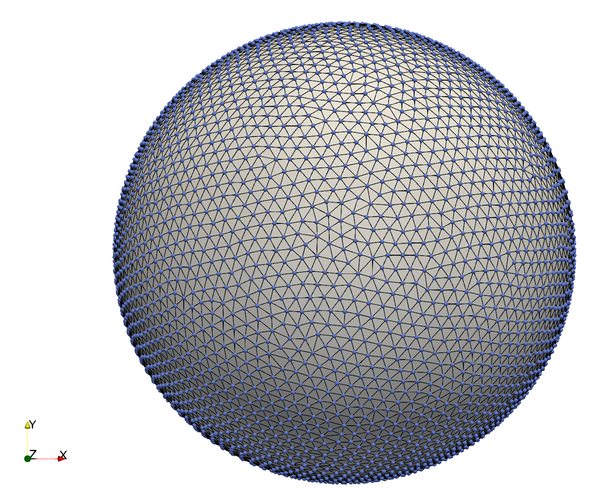

# MeMC
A Monte-Carlo code for the simulation of fluctuating enclosed membranes. Such system can be
of relevance for the study of viruses, exosomes, e.t.c.

## Installation

If all the prequisites are satisfied, the installation is easy. The following
commands should do the job:

```bash
git clone https://github.com/vipinagrawal25/MeMC
cd MeMC
make
```
If successful, one should find an extra "bin" directory in the folder. The bin
directory will contain the binaries "exe_start" and "exe_memc" inside

## Prequisites

The code requires the following:

1) A c++ compiler. We have tested the code against gnu [g++](https://gcc.gnu.org/) version 11.2.0 on x86_64
CPU.
2) [Hdf5](https://www.hdfgroup.org/solutions/hdf5) libraries for reading and writing
data.
3) [Python](https://www.python.org/) version 3.8 (NOTE:: Cross check versions we use) with [scipy](https://www.scipy.org), [numpy](https://www.numpy.org), [h5py](https://www.h5py.org) and
[numpy-quartenion](https://https://pypi.org/project/numpy-quaternion/) installed.

The installation instruction is provided on the pages linked with each package. In
Ubuntu,
```bash
sudo apt install g++ hdf5
```
should install both. The different python libraries can be installed using pip. For
example
```bash
pip install numpy-quartenion
```
installs numpy-quartenion library.


# Using the Code:

We shall now dive deeper and explain the different part of the code. As stated previously, the main
purpose of the MeMC is the Monte-Carlo simulation of enclosed Membranes. For the details check the document on doc/paper.pdf. 

The surface config shown below::


After 60000 monte-carlo steps become::


